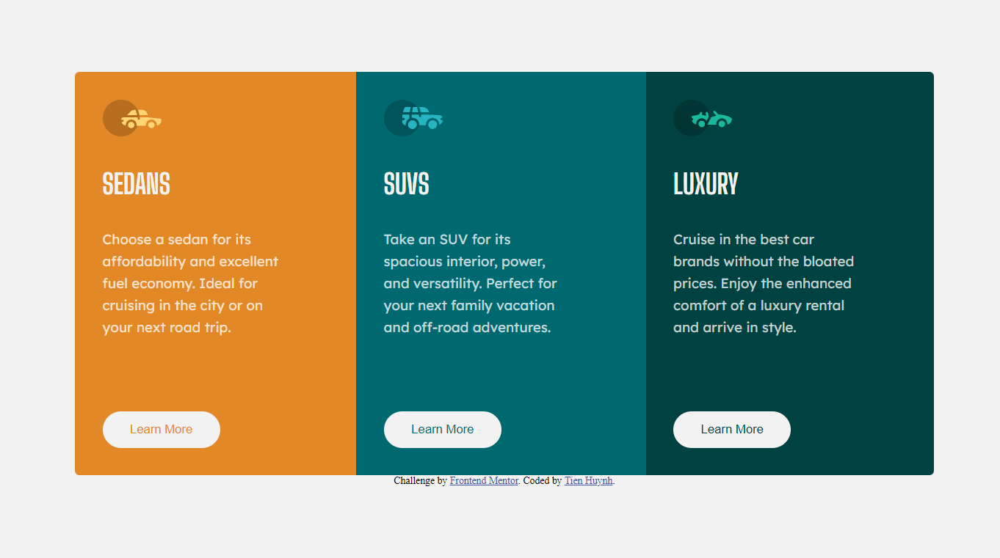

# Frontend Mentor - 3-column preview card component solution

This is a solution to the [3-column preview card component challenge on Frontend Mentor](https://www.frontendmentor.io/challenges/3column-preview-card-component-pH92eAR2-). Frontend Mentor challenges help you improve your coding skills by building realistic projects. 

## Table of contents

- [Overview](#overview)
  - [The challenge](#the-challenge)
  - [Screenshot](#screenshot)
  - [Links](#links)
- [My process](#my-process)
  - [Built with](#built-with)
  - [Continued development](#continued-development)
  - [Useful resources](#useful-resources)
- [Author](#author)
- [License & Copyright](#license)

## Overview

### The challenge

Users should be able to:

- View the optimal layout depending on their device's screen size
- See hover states for interactive elements

### Screenshot

### Links

- Solution URL: [Github](https://github.com/tienhuynh-tn/frontend-mentor-challenges/tree/master/3-column-preview-card-component)
- Live Site URL: [Github Page](https://tienhuynh-tn.github.io/frontend-mentor-challenges/3-column-preview-card-component/)

## My process

### Built with

- Semantic HTML5 markup
- CSS custom properties

### Continued development

I will develop it with an ui that makes it easier for users to see. Waiting for my future features ~~

### Useful resources

- [`README-guide.md`](./README-guide.md) - This will help you to know how to start this project
- [`Original index.html`](./original-index.html) - This is the original `index.html` file from [`Frontend Mentor`](https://www.frontendmentor.io/challenges/3column-preview-card-component-pH92eAR2-)
- [`Design Folder`](./design) - This is the folder for preview the design of web
- [`Images Folder`](./images) - This folder contains images resource 
- [`style-guide.md`](./style-guide.md) - This file containing the information you'll need, such as color palette and fonts
- [`README-template`](./README-template.md) - Use this file if you don't know how to write README.md file and [`Click here`](https://guides.github.com/features/mastering-markdown/) :point_left: to learn how to use MARKDOWN for writing `README.md`
- [`W3Schools`](https://www.w3schools.com/) - This helped me for learning many CSS properties. I really liked this web and will use it going forward.

## Author

- Website - [Tien Huynh](https://github.com/tienhuynh-tn)
- Frontend Mentor - [@tienhuynh-tn](https://www.frontendmentor.io/profile/tienhuynh-tn)
- Facebook - [@tien.huynhlt.tn](https://www.facebook.com/tien.huynhlethuy.tn/)

<h2 id="license">License & Copyright</h2>

&copy; 2021 Tien Huynh tienhuynh-tn Licensed under the [MIT LICENSE](https://github.com/tienhuynh-tn/frontend-mentor-challenges/blob/master/LICENSE).

> :love_you_gesture: Feel free to use my repository and star it if you find something interesting :love_you_gesture:
